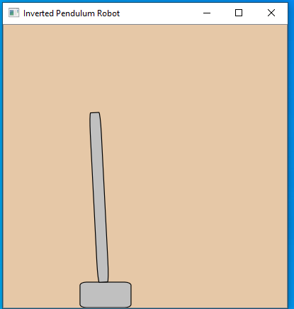

# Inverted Pendulum Simulation

## Background

It was strangely difficult for me to come up with a gpgpu/hetergenous computing application I was interested in.
I looked at raytracing, path planning and some computational geometry algorithms, among others, but didn't find something I could cleanly implement.
After looking back at some introduction to robotics coursework, I decided to look into writing accelerated versions of some of the programs.
The main opportunity that presented itself was the dynamic Linear Quadratic Regulator control strategy as it has a lot of matrix operations.
There were other opportunities such as the extended Kalman Filter used for localization.
The nice part of that application is it can build up very large matrices depending on how many landmarks you are using.

I chose the LQR.  Mostly because I had the initial algorithm implemented in python
and seemed like a good one to parallelize.

First I looked for existing solutions and found a good jumping off point through a [blog post from Gary Evans](http://www.taumuon.co.uk/2016/02/lqr-control-of-inverted-pendulum-in-c-using-eigen.html)
Gary implemented an LQR for an inverted pendulum system using the content from an MIT MOOC, [System Modeling](https://ctms.engin.umich.edu/CTMS/index.php?example=InvertedPendulum&section=SystemModeling)
[State-Space Methods for Controller Design](https://ctms.engin.umich.edu/CTMS/index.php?example=InvertedPendulum&section=ControlStateSpace#6),which appears to also have contributions from Mathworks, UMich and Carnegie Mellon.

So Eigen itself does use Cuda but I don't have evidence that how I am using it explicitly uses cuda.
Specifically, I assume it is not using it in my usage because I'm doing small matrix calculations.
You can use Eigen inside of Cuda kernels which is neat but doesn't seem to have that high of a use case.

## Goals

### Required
- [x] Use cmake to enable easier crossplatform developement
- [x] Add unit test framework to enable faster iterations
- [x] Remove hard coding of system parameters to enable users to experiment
    - [x] Refactor to use xml configs
    - [x] Calculate dependent variables dynamically
    - [] Allow modification of playback speed, currently set at compile time
- [x] Add a gui/visualization so that users can see the performance of their system
- [x] Use Eigen for explicit vectorization to make matrix operations fast
- [x] Replace Eigen operations with Cuda kernels
    - [x] Demonstrate Eigen is faster, a better tool, than GPU for this job
### Nice to have, 2.0
- [] Calculate K at Runtime using Eigen and Cuda.  Currently hitting unknown problems, result is just wrong. Probably an issue with the implemented calculation.
- [] Switch from LQR to dLQR
- [] Make simulation dynamic and interactive
- [] If there are multiple implementations of the same calculations, provide timing analysis
- [] Reimplement all calculations to be done by gpu and time against hybrid and Eigen only
- [] Possibly incorporate WASM and WASM hardware acceleration
- [] Overall, clean everything up.  It's pretty sloppy right now.

## Requirements to Build/Run

- Qt5 Installed
- Cmake Installed
- Cuda compatible device and Cuda Installed
- Git
- Qt Creator Suggested, makes it easier to run.

## Build Steps

- Open cmakelists.txt as a project in QtCreator/Clion
- Use defaults, build/run
- From command line: maybe just run "cmake ." or "cmake install"? Haven't tested or tried this.

### Visualization

- Utilizes Qt
    - Specifically QGraphicsView and QGraphicsScene
    - The main point of interest is the mechanism for advancing the scene.
    QTimer has a signal, timeout, that is connected to the slot, advance, of the QGraphicsObjects.
    Setting the timeout duration, in milliseconds, is how we can control the playback speed.
    Currently, the simulation creates a state for ever millisecond.

Static capture of current visualization, a gif would have been nice:

### Simulation

- Broken into the main InvertedPendulumSim and InvertedPendulumLinearDynamics.
- SystemParameters currently holds a minor portion of the simulation logic as it calculates the moment of inertia about the center of the pole(pendulum.)

### IO

- Currently only the simulation uses parameters from the xml
- Need to pull SystemParameters up a level and out of Simulation
    - Specifically so that we can update the playback speed at runtime without recompiling
    - Also would be good to be able to switch between Eigen and Eigen/GPU hybrid implementations

### Eigen vs Cuda

I initially set out to calculate K, a single time, at run time with both Eigen and Cuda and compare the times.
This is a relatively fair comparison.
Issues I faced with calculating K became insurmountable and I pivoted.
Having only 1.5 weeks available while balancing other responsibilities proved to be too much.

The result is I replaced part of the simulation that should not be done by a GPU.
Part of my analysis is demonstrating this which was exceedingly easy to do.
This part of the simulation consists of basic linear algebra on small vectors and matrices.
Small enough that they fit in the registers of a cpu.
This is a job that Eigen is exlicitly designed to do while GPUs are better at operations with larger data sizes.
The main problem with using the gpu is all of the data transfer between devices.
At least on my machine.
But even on machines where there is more shared hardware between the gpu and cpu, the sizes are small enough that I predict Eigen would still be a better choice.

The time differences are large enough that anecdotal evidence expresses the difference.
Eigen only, visual starts almost instantly.
Eigen + Cuda, visual starts between 30 seconds and a minute for inputs between 10,000 and 50,000

Final note, transferring all the calculations to a gpu device might be faster than a hybrid approach.  For instance the entire trajectory could be vectorized which would reduce the data transfer.